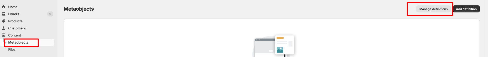
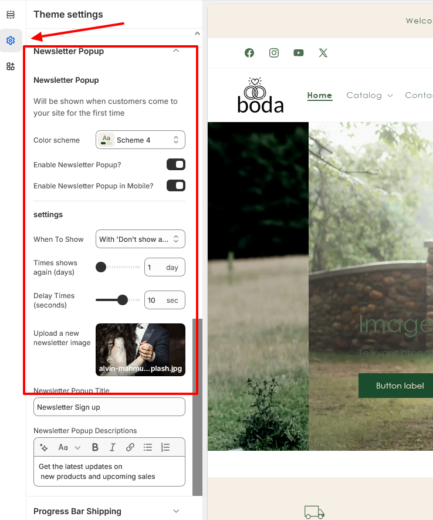
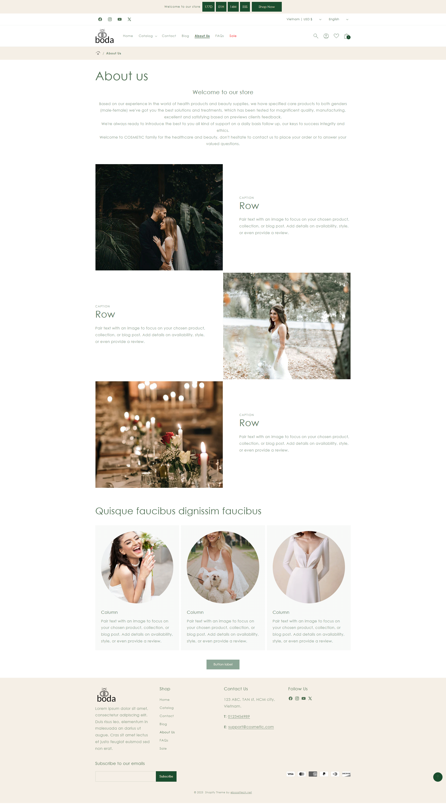

Demo: https://boda-demo.myshopify.com/

Password: 1234

# BODA SHOPIFY THEME

## STANDARD SECTIONS
+ Announcement bar
+ Quick order list
+ Collage
+ Collapsible content
+ Collection list
+ Contact Form
+ Custom Liquid
+ Email signup banner
+ Blog posts
+ Featured collection
+ Featured product
+ Icon With Text
+ Image banner
+ Image with Link
+ Image Banner Overlay
+ Image with text
+ Multicolumn
+ Multirow
+ Email signup
+ Product Tab
+ Quick order list
+ Related products
+ Rich text
+ Product list
+ Slideshow
+ Testimonial
+ Video

## USE SETTING MENU


### Add color for top level

1. Go to Online Store -> Themes -> Customize button
2. Sections -> Header  Sections -> Add block -> Color Menu


3. Select color -> Select url match url that you would like to show color


### Use images for level 1

1. You need add an image for collection. Go to Admin -> Products -> Collection -> select collection -> add an image


2. Go to Online Store -> Themes -> Customize button
3. Sections -> Header  Sections -> Turn on "Show image"


### Add icon for level 2

1. Go to Online Store -> Themes -> Customize button
2. Sections -> Header  Sections -> Add block -> Icon
3. Upload an icon 
4. Select url match url that you would like to show icon


## USE PROGRESS SHIPPING (both cart drawer and cart page)


1. Go to Online Store -> Themes -> Customize button
2. Settings -> Progress Bar Shipping -> check Enable Progress Bar shipping to turn on it
3. Add total price, messages for free shipping


## USE COUNTDOWN ON PRODUCT DETAIL PAGE

To enbable countdown on product detail page. We need follow step by step below:


1. Go to Online Store -> Themes -> Customize button -> Settings
2. Expand Product cards -> click Enable Countdown? to enable this featured


3. Select option 
	- Use for all products -> If you chose this option After that go to step 4 
	- Use for different product -> If you chose this option. After that go to step 5
4. Add a deal time with a format like "2025/12/25 22:11:00". This time must be greater than the current time.

5. Go to Settings->Metafields and metaobjects -> Products -> click Add definition button on top right 


6. Create a metafield

```bash

Namespace: custom
Key: countdown
Type: Date and time

```


7. Go to  products -> Select product that you would like to show count down

8. Add a deal time for this product. This time must be greater than the current time.




## SETTING TO SHOW WISHLIST


1. Go to Online Store -> Themes -> Customize button -> Settings

2. Expand Product cards -> click "Enable Wishlist?" to show wishlist icon on card product and product detail page


3. Go to Sections -> Header section -> check "Enable Header Wishlist" 


3.  Go to Online Store -> Pages -> Create wishlist page

```bash

URL and handle: wish-list
Theme template: wishlist

```


## TURN ON THE COMPARISON ON THE COLLECTION PAGE


1. Go to Online Store -> Themes -> Customize button -> Theme settings
2. Expand Compare Products tab
3. Turn on/off and update your setting 


## TURN ON THE NEWSLETTER POPUP


1. Go to Online Store -> Themes -> Customize button -> Theme settings
2. Expand Newsletter Popup tab
3. Turn on/off and update your setting 





## SETUP COLOR SWATCH ON PRODUCT CARD


1. Go to Online Store -> Themes -> Customize button -> Settings

2. Expand Product cards 

3. Add name of option that you would like to show the color swatch ( ex: color or colour ....)


## HOME PAGE


## COLLECTION PAGE


 
##  PRODUCT DETAIL PAGE


##  CART PAGE


##  WISH LIST


##  FAQ


##  ABOUS US




##  CONTACT US


##  BLOG


## Bugs/Feature Requests & Contribution

Please do open a pull request on GitHub should you want to contribute, or create an issue.

## License
[BSD-4-Clause](http://directory.fsf.org/wiki/License:BSD_4Clause) - Do as you wish 👍

## Our website

https://www.eboosttech.net

[DONATE](https://paypal.me/eboost10)  `❤❤❤`
